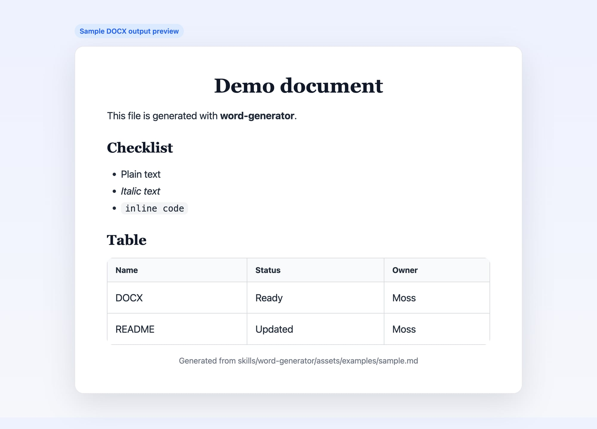

# word-generator

Generate `.docx` files locally from plain text, Markdown, or Markdown templates.

This repository is structured as an **OpenClaw skill repo**. The main publishable unit is:

- `skills/word-generator/`

It can be used in two ways:

1. as an OpenClaw skill
2. as a small local Python-based DOCX generator

## Preview



---

## Features

- Generate Word documents (`.docx`) locally
- Convert plain text into paragraphs
- Convert Markdown strings or Markdown files
- Fill Markdown templates with `{{placeholders}}`
- Support headings, bullet lists, simple tables, and inline formatting
- Support local and remote images
- Package the skill as a distributable `.skill` archive

---

## Repository Layout

```text
skills/
  word-generator/
    SKILL.md
    scripts/create_docx.py
    assets/examples/
      sample.md
      report-template.md
      report-vars.json

dist/
  word-generator.skill
```

Notes:
- `skills/word-generator/` is the important part for OpenClaw.
- `dist/word-generator.skill` is the packaged distribution artifact.

---

## Requirements

Target machine requirements:

- Python 3
- `python-docx`

Install the dependency with:

```bash
pip install python-docx
```

If you prefer a virtual environment:

```bash
python3 -m venv .venv
source .venv/bin/activate
pip install python-docx
```

---

## Quick Start

### Plain text

```bash
python3 skills/word-generator/scripts/create_docx.py \
  --title "Quick Note" \
  --text $'First paragraph\nSecond paragraph' \
  --output ./out/note.docx
```

### Markdown file

```bash
python3 skills/word-generator/scripts/create_docx.py \
  --markdown-file skills/word-generator/assets/examples/sample.md \
  --output ./out/sample.docx
```

### Template + variables

```bash
python3 skills/word-generator/scripts/create_docx.py \
  --template-file skills/word-generator/assets/examples/report-template.md \
  --vars-file skills/word-generator/assets/examples/report-vars.json \
  --output ./out/report.docx
```

---

## OpenClaw Installation

If you want to use it as an OpenClaw skill, place the `word-generator` skill folder inside an OpenClaw skills directory.

Example target layout:

```text
~/.openclaw/workspace/skills/
  word-generator/
    SKILL.md
    scripts/create_docx.py
    assets/examples/...
```

Once present, OpenClaw can load the skill when a task matches DOCX/Word document generation.

Important:
- the skill structure is self-contained under `skills/word-generator/`
- the host still needs Python and `python-docx`

---

## Package as a `.skill`

If you have OpenClaw's `package_skill.py` available, run:

```bash
python3 /path/to/openclaw/skills/skill-creator/scripts/package_skill.py \
  ./skills/word-generator \
  ./dist
```

Expected output:

```text
./dist/word-generator.skill
```

This package can then be distributed or installed wherever `.skill` files are supported.

---

## Command Reference

Supported CLI options:

```text
--title             Document title
--text              Body text with newline-separated paragraphs
--paragraphs-json   JSON array of paragraphs
--markdown          Markdown string
--markdown-file     Markdown file path
--template-file     Template file path with {{placeholders}}
--vars-json         JSON object for template variables
--vars-file         JSON file for template variables
--output            Output .docx path (required)
```

---

## Supported Markdown

Current support includes:

- headings: `#`, `##`, `###`
- plain paragraphs
- unordered lists using `-`, `*`, `+`
- simple pipe tables
- local images: ``
- remote images: ``
- inline formatting:
  - `**bold**`
  - `*italic*`
  - `` `code` ``

---

## Examples

### Example template placeholders

```text
{{title}}
{{owner}}
{{summary}}
```

Unknown placeholders are kept as-is.

### Example output paths

```text
./out/note.docx
./out/sample.docx
./out/report.docx
```

---

## Limitations

This is intentionally a lightweight generator, not a full Markdown-to-Word publishing engine.

Current limitations:

- no advanced table styling
- no ordered list numbering logic
- no complex nested Markdown structures
- no custom theme/style pack system
- no guaranteed fidelity for every Markdown dialect

If a remote image is unavailable or invalid, the document will contain a fallback marker like:

```text
[missing image: ...]
```

---

## Troubleshooting

### `ModuleNotFoundError: No module named 'docx'`

Install the dependency:

```bash
pip install python-docx
```

### Output file was not created

Check that:
- `python3` is available
- the output directory is writable
- the input file path is correct

### Local images do not render

Local image paths are resolved relative to the Markdown/template file, not necessarily the current shell directory.

### Remote images do not render

Possible reasons:
- the URL is invalid
- the remote server blocked the request
- the response is not actually an image
- the image is too large

---

## For ClawHub / Distribution

This repository is now arranged so the important skill content lives inside a self-contained skill folder:

- `skills/word-generator/`

That makes it easier to:
- package into `.skill`
- move between OpenClaw environments
- publish through skill distribution workflows later

---

## License

See `LICENSE`.
